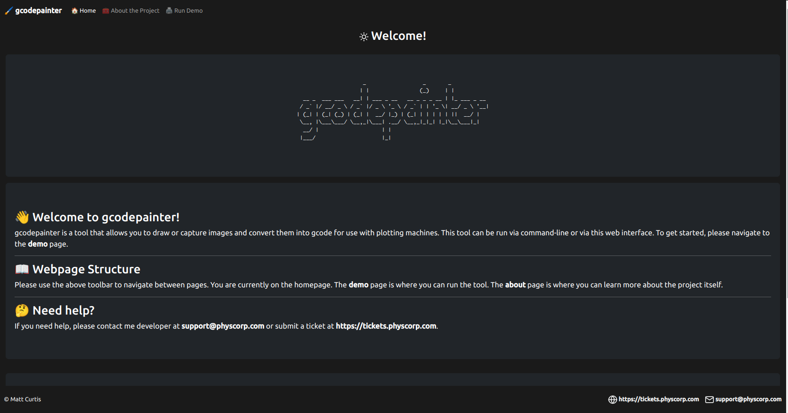
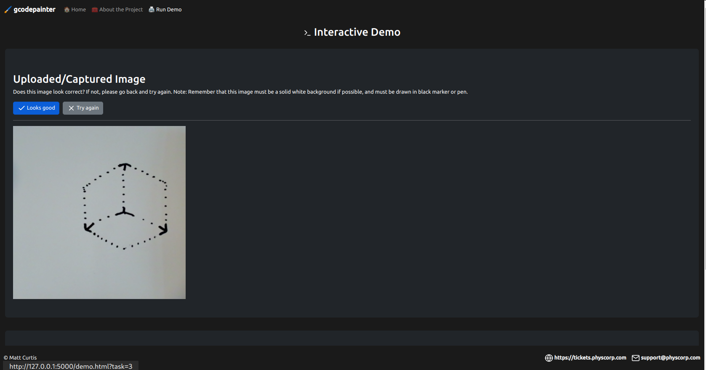
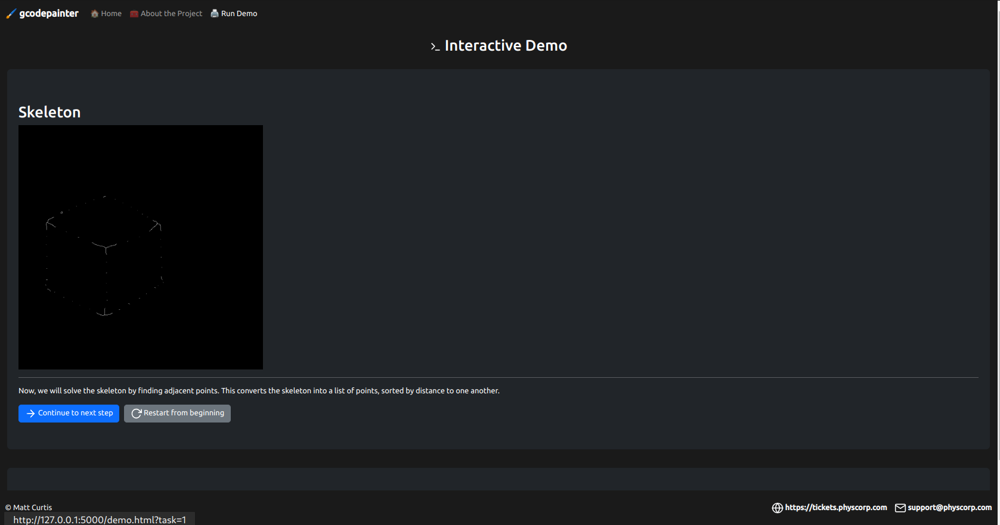
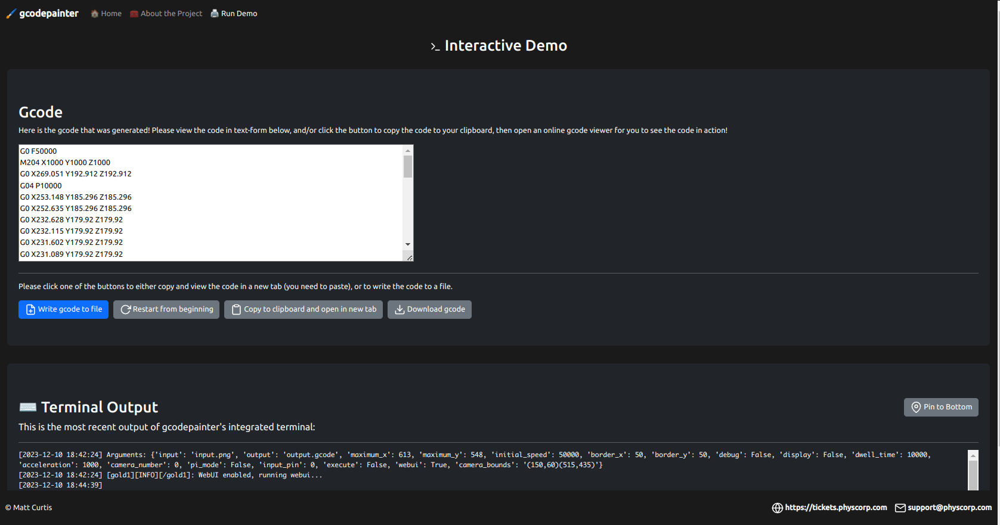

# Project Report: gcodepainter

## Introduction and Motivation
I am Matt Curtis, known as PhysCorp on GitHub. I developed gcodepainter, a tool designed to convert PNG images into GCODE for plotting machines. This project combines my interests in 3D printing, plotting machines, and image processing, aiming to provide an easy-to-use solution for both enthusiasts and professionals in these fields.

## Overview of gcodepainter
gcodepainter is a practical tool that transforms PNG images into GCODE, making them suitable for plotting machines. It's particularly useful for those interested in 3D printing, offering a straightforward approach to image conversion.

### Environment and Dependencies
- **Managed via Conda:** The project uses Conda for environment management, ensuring a streamlined setup process.
- **Python Version:** Python 3.8 is specifically used for compatibility, and required to make this work.
- **Key Libraries:** The tool uses libraries like opencv-python, numpy, flask, and rich.
- **Installation:** For detailed installation instructions and more technical details, please refer to the `README` file in the project repository.

### Project Usage
- **Basic Operation:** The tool runs using simple commands, launching a Flask-based GUI for user interaction.
- **Optional Pronterface Integration:** Pronterface support is included for direct printing to plotting machines on Windows only.
- **Configurable Settings:** Various default settings are available for customization, specified in the `README` file.

## Methods and Implementation

### Practical Application Focus
- The project centers around being a practical tool in GCODE generation and image processing. It's designed to be easy to use, with a straightforward interface and simple commands, allowing users to quickly convert images into GCODE and plot them.

### Technical Structure
- **WebUI Class:** Manages the website using Flask, handling webpage serving and HTML content.
- **AutoClass:** Dedicated to image processing with opencv, breaking down the process into functions for tasks like image cropping and thresholding.
- **Third-Party Libraries:** Flask for web serving and opencv for image processing, with numpy for array manipulation.
- **File I/O Operations:** GCODE is saved to disk with error handling for reliability, alerting user if file cannot be saved.

### Visualization and Interaction
- The Flask web interface is a key feature, providing a platform to visualize each image processing step for better user understanding.

- The web interface (shown above) allows users to upload an image, view each processing step's image output, and download/print the resulting GCODE. Each step is visualized on the webpage in the form of a small text snippet and a modified image based on what the user uploads.

- Screenshot of the user uploading the webcam capture of a cube. 

- Screenshot one of the opencv steps to convert the image into a skeletonized image.

- After the GCODE is converted, it offers an option to copy the GCODE to the clipboard and view it on an open-source plotting webpage at https://nraynaud.github.io/webgcode/ `(you are required to paste in the GCODE yourself and click Simulate)`. Alternatively, you can download the GCODE file directly.

- This program also supports the ability to execute the GCODE directly to a plotting machine, if you have one connected to your computer and if you have `Pronterface` installed on your *WINDOWS* computer.

## Project Achievements

### Fulfillment of Requirements
- **Practical Application:** Focused on enhancing knowledge in GCODE and image processing.
- **Development of Functions:** Created WebUI and AutoClass classes with multiple functions, exceeding the basic requirements. WebUI manages the Flask web interface and manipulates HTML content to show the live demo, while AutoClass handles image processing and GCODE generation, breaking down the process into functions for tasks like image cropping and thresholding.
- **Third-party Library Usage:** Effectively incorporated Flask and opencv.
- **File I/O with Error Handling:** Implemented in the GCODE export process, alerting user if the file was unable to be saved.
- **Visualization of Outcomes:** The Flask web interface allows users to upload an image, view step in processing with opencv, and download/print the resulting GCODE.

### Additional Features
- **Pronterface Support:** For direct GCODE execution to plotting machines on Windows.
- **Community Engagement:** The project is open-source, inviting community use and contributions. It's available on GitHub at https://github.com/PhysCorp/gcodepainter.

## Results and Impact
- **User Interface:** Both a command-line tool and a web interface via Flask API.
- **Process Visualization:** Each image processing step is displayed on the web interface.
- **GCODE Interaction:** Users can view, copy, and download the generated GCODE. Direct execution to a plotting machine is supported if the setup allows.
- **Community Engagement:** The project is open-source, inviting community use and contributions.

## Conclusion
In creating gcodepainter, I aimed to develop a tool that is both functional and educational. It serves as a valuable resource for those interested in 3D printing, plotting, and image processing. As an open-source project, it encourages community involvement, hoping to inspire others to explore these fields and contribute to the project.